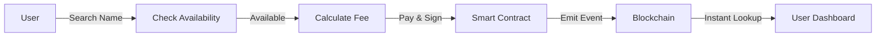

# Push Name Service (PNS)

> Human-readable names for the Push Chain ecosystem

[](https://opensource.org/licenses/MIT)
[](https://push.org)

## 🌟 Overview

Push Name Service (PNS) is a decentralized naming system built on Push Chain that allows users to register human-readable names (like `alice.push`) instead of using complex blockchain addresses. Think of it as the DNS for the Push Chain ecosystem.

**Live Demo**: [https://pns.push.org](https://universal-name-service.vercel.app/)

## ✨ Features

### 🎯 Core Features
- **Universal Compatibility**: Works with Push Chain, Ethereum, and Solana wallets
- **Human-Readable Names**: Replace `0x742d35Cc6634C0532925a3b844Bc9e7595f0bEb` with `alice.push`
- **Rich Metadata**: Add avatar, email, website, and social links to your name
- **Cross-Chain Resolution**: Names registered from any chain are accessible everywhere
- **Name Management**: Transfer, renew, and update your names easily
- **Premium Names**: Special pricing for 3-letter and popular names

### 🚀 Technical Features
- **Decentralized**: All name records stored on-chain

- **Gas Efficient**: Optimized smart contract design
- **Event-Driven**: Real-time updates via blockchain events
- **Secure**: Ownership verification and safe transfer mechanisms

## 📋 Table of Contents

- [Getting Started](#getting-started)
- [How It Works](#how-it-works)
- [Smart Contract](#smart-contract)
- [Architecture](#architecture)
- [Usage Examples](#usage-examples)
- [SDK](#sdk)
- [API Reference](#api-reference)
- [Development](#development)
- [Deployment](#deployment)
- [Contributing](#contributing)
- [License](#license)

## 🚀 Getting Started

### Prerequisites

- Node.js >= 18.x
- npm or yarn
- A Push Chain wallet (or Ethereum/Solana wallet)
- Testnet tokens for registration

### Installation
```bash
# Clone the repository
git clone https://github.com/Miracle656/universal_name_service.git
cd universal_name_service

# Install dependencies
npm install

# Set up environment variables
cp .env.example .env

# Start development server
npm run dev
```

### Environment Variables
```env
# Push Chain Configuration
VITE_PUSH_CHAIN_RPC=https://evm.rpc-testnet-donut-node1.push.org/
VITE_CONTRACT_ADDRESS=0x2Fa83bc81c688D5edc760D4cBB60320501Ae67eC
```

## 🔧 How It Works

### Name Registration Flow


### Architecture Overview
```
┌─────────────────────────────────────────────────────────┐
│                    Frontend (React)                      │
│  ┌──────────────┐  ┌──────────────┐  ┌──────────────┐ │
│  │ Name Search  │  │  My Names    │  │   Profile    │ │
│  └──────────────┘  └──────────────┘  └──────────────┘ │
└─────────────────────────────────────────────────────────┘
                          │
        ┌─────────────────┼─────────────────┐
        │                 │                 │
        ▼                 ▼                 ▼

// Check if name is available
function isNameAvailable(string name) external view returns (bool);

// Get name record
function getNameRecord(string name) external view returns (NameRecord);

// Update metadata
function setMetadata(string name, string avatar, string email, ...) external;

// Transfer name
function transfer(string name, address newOwner) external;

// Renew name
function renew(string name) external payable;

// Resolve name to address
function resolve(string name) external view returns (address);
```

### Events
```solidity
event NameRegistered(
    bytes32 indexed nameHash,
    string name,
    address indexed owner,
    uint256 expiresAt,
    string originChainNamespace,
    string originChainId,
    bool isPremium
);

event NameTransferred(
    bytes32 indexed nameHash,
    string name,
    address indexed from,
    address indexed to
);

event MetadataUpdated(
    bytes32 indexed nameHash,
    string name,
    address updatedBy
);

event NameRenewed(
    bytes32 indexed nameHash,
    string name,
    uint256 newExpiresAt,
    address renewedBy
);
```

## 🏗️ Architecture

### Technology Stack

#### Frontend
- **React** - UI framework
- **TypeScript** - Type safety
- **Tailwind CSS** - Styling
- **shadcn/ui** - Component library
- **ethers.js** - Blockchain interaction
- **@pushchain/ui-kit** - Push Chain wallet integration

#### Backend

- **Push Chain RPC** - Blockchain queries
- **IPFS** (optional) - Decentralized metadata storage

#### Smart Contracts
- **Solidity** - Contract language
- **Hardhat** - Development environment
- **OpenZeppelin** - Contract libraries

### Data Flow

1. **Registration**
```
   User → Frontend → Smart Contract → Blockchain
                                        ↓
   User ← Frontend ← Event Indexer
```

2. **Name Lookup**
```
   User → Frontend → Blockchain → Index → Response
```

## 💡 Usage Examples

### Basic Name Registration
```typescript
import { PNSClient, PNSNetwork } from '@miracleorg/pns-sdk';
import { JsonRpcProvider, Wallet } from 'ethers';

// Initialize SDK
const provider = new JsonRpcProvider('https://rpc.push.org');
const signer = new Wallet(process.env.PRIVATE_KEY, provider);

const pns = await PNSClient.initialize(signer, {
  network: PNSNetwork.TESTNET
});

// Check availability
const availability = await pns.isNameAvailable('alice');

if (availability.available) {
  // Register name
  const tx = await pns.register({ name: 'alice' });
  await tx.wait();
  
  console.log('Registered!', tx.hash);
}
```

### Resolve Name to Address
```typescript
// Resolve name
const address = await pns.resolve('alice');
console.log('alice.push resolves to:', address);
```

### Get All Names for Address
```typescript
// Get names owned by address
const names = await pns.getNamesByOwner('0x...');
console.log('Found names:', names);
```

### Update Metadata
```typescript
// Update profile info
await pns.setMetadata({
  name: 'alice',
  avatar: 'https://example.com/avatar.png',
  email: 'alice@example.com',
  twitter: '@alice',
  github: 'alice',
  description: 'Builder on Push Chain',
});
```

## 📦 SDK

For developers looking to integrate PNS into their applications, we provide an official SDK:
```bash
npm i @miracleorg/universal-name-service ethers
```

**SDK Features:**
- ✅ Full TypeScript support
- ✅ Tree-shakeable
- ✅ Batch operations
- ✅ Caching layer
- ✅ Event subscriptions
- ✅ React hooks

**Documentation**: [SDK Documentation](https://www.npmjs.com/package/@miracleorg/universal-name-service)


## 🤝 Contributing

We welcome contributions!.

### Development Workflow

1. Fork the repository
2. Create a feature branch (`git checkout -b feature/amazing-feature`)
3. Commit your changes (`git commit -m 'Add amazing feature'`)
4. Push to branch (`git push origin feature/amazing-feature`)
5. Open a Pull Request

### Code Style

- Use TypeScript for type safety
- Follow ESLint configuration
- Write tests for new features
- Update documentation

## 🗺️ Roadmap

### Phase 1: MVP (Current)
- [x] Basic name registration
- [x] Metadata support
- [x] Transfer & renewal

- [x] Cross-chain compatibility

### Phase 2: Enhancement (Q1 2025)
- [x] SDK release
- [x] ENS/SNS integration
- [ ] Subdomain support
- [ ] Name marketplace
- [ ] Mobile app

### Phase 3: Expansion (Q2 2025)
- [ ] DAO governance
- [ ] Premium features
- [ ] Analytics dashboard
- [ ] Enterprise solutions
- [ ] Multi-chain expansion

## 📞 Support & Community (not active)

- **Discord**: [Join our Discord](https://discord.gg/push)
- **Twitter**: [@PushProtocol](https://twitter.com/pushprotocol)
- **Documentation**: [docs.push.org/pns](https://docs.push.org)
- **Email**: support@push.org

## 📄 License

This project is licensed under the MIT License - see the [LICENSE](LICENSE) file for details.

## 🙏 Acknowledgments

- Push Protocol team for the infrastructure
- OpenZeppelin for secure contract libraries

---

**Built with ❤️ by the Push Protocol community**
